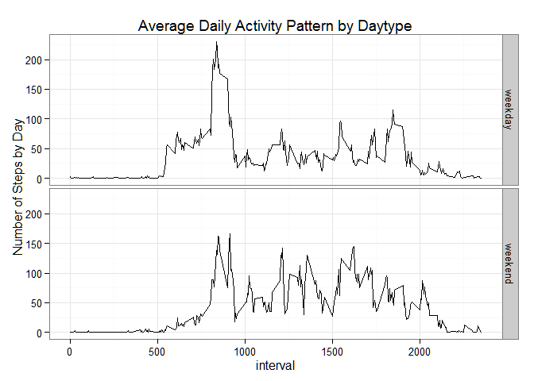

# Reproducible Research: Peer Assessment 1


## Loading and preprocessing the data
Unzip the csv file from the archive

```r
unzip("activity.zip")
```
Read the csv file

```r
ActivityData <- read.csv("activity.csv",header = TRUE)
```
Set the data types of the fields

```r
ActivityData$steps <- as.numeric(ActivityData$steps)
ActivityData$date <- as.Date(ActivityData$date)
ActivityData$interval <- as.numeric(ActivityData$interval)
```

## What is mean total number of steps taken per day?

Create an aggregated dataset with the sum of steps by day

```r
StepsByDay <- aggregate(steps ~ date, FUN = sum, data = ActivityData)
```
Create the histogram

```r
hist(StepsByDay$steps,
     col = "Blue",
     main = "Frequency of Total Number of Steps Taken Each Day",
     xlab = "Number of Steps by Day",
     ylab = "Frequency")
```

 

Calculate the mean of the steps by day

```r
mean(StepsByDay$steps, na.rm = TRUE)
```

```
## [1] 10766.19
```
Calculate the median of the steps by day

```r
median(StepsByDay$steps, na.rm = TRUE)
```

```
## [1] 10765
```

## What is the average daily activity pattern?

Create an aggregated dataset with the mean of steps by interval

```r
StepsByInterval <- aggregate(steps ~ interval, FUN = mean, data = ActivityData)
```
Create the line chart

```r
plot(StepsByInterval$steps ~ StepsByInterval$interval,
     col = "Blue",
     type = "l",
     main = "Average Daily Activity Pattern",
     xlab = "5-minute interval",
     ylab = "Avg Nbr of Steps by Day")
```

 

## Imputing missing values

Calculate the total number of missing values in the dataset

```r
sum(is.na(ActivityData))
```

```
## [1] 2304
```
Create a new dataset where the missing values are filled in with the means for the relevant 5-minute interval

```r
ActivityDataNoNA <- ActivityData
ActivityDataNoNA$steps[is.na(ActivityDataNoNA$steps)] <- tapply(ActivityDataNoNA$steps, ActivityDataNoNA$interval, mean, na.rm = TRUE)
StepsByDayNoNA <- aggregate(steps ~ date, FUN = sum, data = ActivityDataNoNA)
```
Create the histogram

```r
hist(StepsByDayNoNA$steps,
     col = "Green",
     main = "Missing values replaced with mean of 5-minutes interval",
     xlab = "Number of Steps by Day",
     ylab = "Frequency")
```

 

Calculate the mean of the steps by day (no impact of imputing the missing data)

```r
mean(StepsByDayNoNA$steps, na.rm = TRUE)
```

```
## [1] 10766.19
```
Calculate the median of the steps by day (the median is the same as the mean because of imputing the missing data)

```r
median(StepsByDayNoNA$steps, na.rm = TRUE)
```

```
## [1] 10766.19
```

## Are there differences in activity patterns between weekdays and weekends?
Create a new factor variable indicating whether a given date is a weekday or weekend day.

```r
ActivityDataNoNA$date <- as.Date(ActivityDataNoNA$date)
ActivityDataNoNA$daytype <- as.factor(ifelse(weekdays.Date(ActivityDataNoNA$date) %in% c("Saturday", "Sunday"), "weekend", "weekday"))
```
Create an aggregated dataset with the sum of steps by day

```r
StepsByIntervalWeekDay <- aggregate(ActivityDataNoNA$steps, by = list(ActivityDataNoNA$daytype, ActivityDataNoNA$interval), FUN = mean, data = ActivityDataNoNA)
names(StepsByIntervalWeekDay) <- c("daytype", "interval", "steps")
require(ggplot2)
```

```
## Loading required package: ggplot2
```
Create the panel plot with the two line charts

```r
ggplot(StepsByIntervalWeekDay, aes(interval, steps))+
        geom_line() +
        theme_bw() +
        ylab("Number of Steps by Day") +
        ggtitle("Average Daily Activity Pattern by Daytype") +
        facet_grid(daytype ~ .)
```

 
